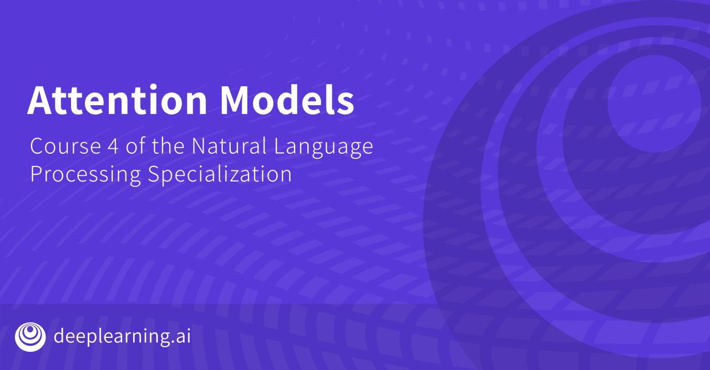

# Natural Language Processing with Probabilistic Model
Welcome to the [fourth course](https://www.coursera.org/learn/attention-models-in-nlp) of the Natural Language Processing Specialization at [Coursera](https://www.coursera.org/specializations/natural-language-processing) which is moderated by [DeepLearning.ai](http://deeplearning.ai/). The course is taught by Younes Bensouda Mourri, Łukasz Kaiser and Eddy Shyu.

# My Certificate

# Table of Contents
