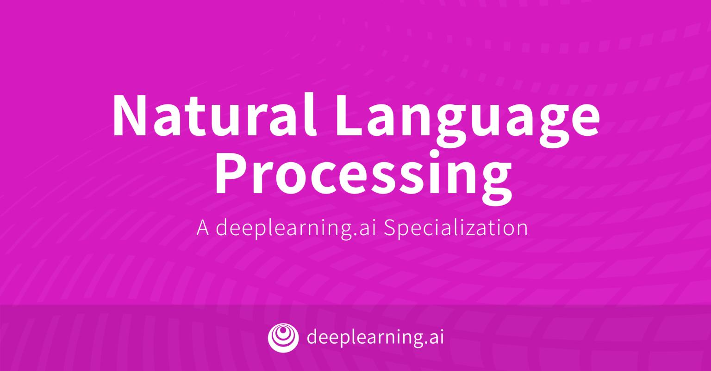

# My GAN Specialization repository
[**Click on the image**](https://github.com/ijelliti/Deeplearning.ai-Generative-Adversarial-Networks-Specialization)

# DeepLearning.ai NLP Specialization Courses Notes
This repository contains my personal notes on [DeepLearning.ai](https://deeplearning.ai) NLP specialization courses.

[DeepLearning.ai](https://deeplearning.ai) contains four courses which can be taken on [Coursera](https://www.coursera.org/specializations/natural-language-processing). The four courses are:

1. [Natural Language Processing with Classification and Vector Spaces](https://github.com/ijelliti/Deeplearning.ai-Natural-Language-Processing-Specialization/tree/master/1%20-%20Natural%20Language%20Processing%20with%20Classification%20and%20Vector%20Spaces)
2. [Natural Language Processing with Probabilistic Models](https://github.com/ijelliti/Deeplearning.ai-Natural-Language-Processing-Specialization/tree/master/2%20-%20Natural%20Language%20Processing%20with%20Probabilistic%20Models)
3. [Natural Language Processing with Sequence Models](https://github.com/ijelliti/Deeplearning.ai-Natural-Language-Processing-Specialization/tree/master/3%20-%20Natural%20Language%20Processing%20with%20Sequence%20Models)
4. [Natural Language Processing with Attention Models](https://github.com/ijelliti/Deeplearning.ai-Natural-Language-Processing-Specialization/tree/master/4%20-%20Natural%20Language%20Processing%20with%20Attention%20Models)

# About This Specialization (From the official NLP Specialization page)
- Natural Language Processing (NLP) uses algorithms to understand and manipulate human language. This technology is one of the most broadly applied areas of machine learning. As AI continues to expand, so will the demand for professionals skilled at building models that analyze speech and language, uncover contextual patterns, and produce insights from text and audio.

- By the end of this Specialization, you will be ready to design NLP applications that perform question-answering and sentiment analysis, create tools to translate languages and summarize text, and even build chatbots. These and other NLP applications are going to be at the forefront of the coming transformation to an AI-powered future.

- This Specialization is designed and taught by two experts in NLP, machine learning, and deep learning. Younes Bensouda Mourri is an Instructor of AI at Stanford University who also helped build the Deep Learning Specialization. Łukasz Kaiser is a Staff Research Scientist at Google Brain and the co-author of Tensorflow, the Tensor2Tensor and Trax libraries, and the Transformer paper.

# Applied Learning Project
*This Specialization will equip you with the state-of-the-art deep learning techniques needed to build cutting-edge NLP systems:*

• Use logistic regression, naïve Bayes, and word vectors to implement sentiment analysis, complete analogies, and translate words, and use locality sensitive hashing for approximate nearest neighbors.

• Use dynamic programming, hidden Markov models, and word embeddings to autocorrect misspelled words, autocomplete partial sentences, and identify part-of-speech tags for words.

• Use dense and recurrent neural networks, LSTMs, GRUs, and Siamese networks in TensorFlow and Trax to perform advanced sentiment analysis, text generation, named entity recognition, and to identify duplicate questions.

• Use encoder-decoder, causal, and self-attention to perform advanced machine translation of complete sentences, text summarization, question-answering and to build chatbots. Models covered include T5, BERT, transformer, reformer, and more!
Enjoy!

# Usage

I share the assignment notebooks with my prefilled and from the contributors code structred as in the course Course/Week
The assignment notebooks are subject to changes through time.

# Connect with your mentors and fellow learners on Slack!
Once you enrolled to the course, you are invited to join a slack workspace for this specialization:
Please join the Slack workspace by going to the following link [deeplearningai-nlp.slack.com](https://deeplearningai-nlp.slack.com)
This Slack workspace includes all courses of this specialization.
# Contact Information
- Twitter: [@IbrahimJelliti](https://twitter.com/IbrahimJelliti)
- LinkedIn: [@ibrahimjelliti](https://www.linkedin.com/in/ibrahimjelliti/)
- the specialization slack channel:  @ibrahim 
# Stargazers over Time

 

Ibrahim Jelliti © 2020
